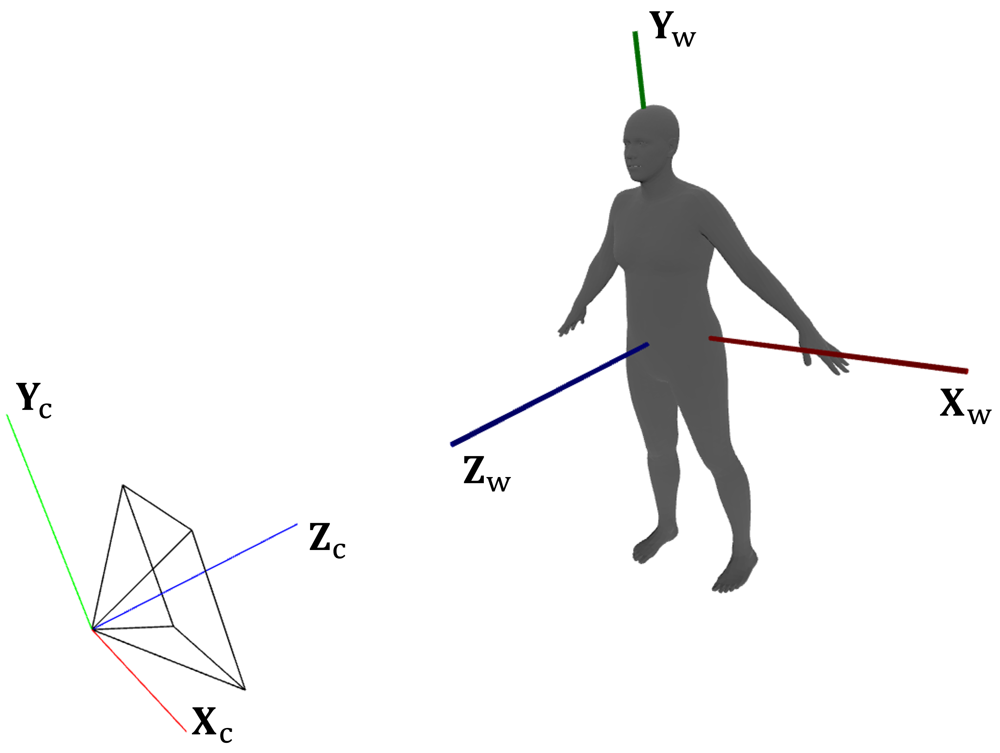

<h1 align="center">DreamWaltz-G: Expressive 3D Gaussian Avatars from Skeleton-Guided 2D Diffusion</h1>

<p align="center">

<div align="center">

<a href='https://arxiv.org/abs/2409.17145'></a> &nbsp;
<a href='https://yukun-huang.github.io/DreamWaltz-G/'></a> &nbsp;
<a href='https://huggingface.co/KevinHuang/DreamWaltz-G'></a>

_**[Yukun Huang](https://yukun-huang.github.io/),
[Jianan Wang](https://github.com/wendyjnwang),
[Ailing Zeng](https://ailingzeng.site),
[Zheng-Jun Zha](https://en.auto.ustc.edu.cn/2021/0616/c26828a513174/page.htm),
[Lei Zhang](https://www.leizhang.org),
[Xihui Liu](https://xh-liu.github.io)**_
<br>

</div>

## 🪄 Introduction

<p align="middle">

<br>
<em><b>DreamWaltz-G</b> is a novel learning framework for text-driven 3D avatar creation and expressive whole-body animation. Its core design lies in hybrid 3D Gaussian avatar representation and skeleton-guided 2D diffusion. Our method supports diverse applications like shape control & editing, 2D human video reenactment, and 3D Gaussian scene composition.</em>
</p>

## 📢 News
- [2025-06-27] 📢Accepted to TPAMI 2025!
- [2024-11-20] 🔥[New feature] Reenact arbitrary in-the-wild video with our avatars! (thank @[gt732](https://github.com/gt732))
- [2024-10-15] 🔥Release the training and inference code.
- [2024-10-15] 🔥Release the [pre-trained models](https://huggingface.co/KevinHuang/DreamWaltz-G/tree/main/outputs) of 12 full-body 3D Gaussian avatars ready for inference.
- [2024-10-15] 🔥Release a [dataset](https://huggingface.co/KevinHuang/DreamWaltz-G/tree/main/datasets/Motion-X-ReEnact) for 2D human video reenactment. It comprises 19 human motion scenes with original videos, inpainted videos (where humans are removed), SMPL-X motions, and camera parameters.
- [2024-09-26] 📢Publish the [arXiv preprint](https://arxiv.org/abs/2409.17145) and update the [project page](https://yukun-huang.github.io/DreamWaltz-G/).

## ⚙️ Setup
Please follow the instructions below to get the code and install dependencies.
1. Clone this repository and navigate to `DreamWaltz-G` folder:
```bash
git clone --branch main --single-branch https://github.com/Yukun-Huang/DreamWaltz-G.git
cd DreamWaltz-G
```
2. Install packages. Note that `requirements.txt` is automatically generated and may not be accurate. We recommend using the provided script for installation:
```bash
bash scripts/install.sh
```
3. Activate the installed conda environment:
```bash
conda activate dreamwaltz
```
4. [Optonal] Similar to [DreamWaltz](https://github.com/IDEA-Research/DreamWaltz/), the cuda extensions (heavily borrowed from [stable-dreamfusion](https://github.com/ashawkey/stable-dreamfusion) and [latent-nerf](https://github.com/eladrich/latent-nerf)) for [Instant-NGP](https://nvlabs.github.io/instant-ngp/) are required and will be built at runtime. But if you want to build them manually, the following commands may be useful:
```bash
python -m core.nerf.freqencoder.backend
python -m core.nerf.gridencoder.backend
python -m core.nerf.raymarching.rgb.backend
# python -m core.nerf.raymarching.latent.backend  # uncomment this if you want to use Latent-NeRF
```

## 🤖 Models
### 1. Human Templates (Required for Training and Inference)
Before running the code, you need to prepare the human template models: [SMPL-X](https://smpl-x.is.tue.mpg.de/), [FLAME](https://flame.is.tue.mpg.de/), and [VPoser](https://smpl-x.is.tue.mpg.de/). Please download them from the official project pages: https://smpl-x.is.tue.mpg.de/ and https://flame.is.tue.mpg.de/, then organize them following the structure below:
```
external
└── human_templates
    ├── smplx
    │   ├── SMPLX_NEUTRAL_2020.npz
    │   ├── FLAME_vertex_ids.npy
    │   ├── MANO_vertex_ids.pkl
    │   └── smplx_vert_segmentation.json
    ├── flame
    │   └── FLAME_masks.pkl
    └── vposer
        └── v2.0
            ├── snapshots
            │   ├── V02_05_epoch=08_val_loss=0.03.ckpt
            │   └── V02_05_epoch=13_val_loss=0.03.ckpt
            ├── V02_05.yaml
            └── V02_05.log
```
If you already have these models on your machine, you can simply modify the path in `configs/path.py` to link to them.

### 2. Pre-trained Instant-NGP (Required for Training)
DreamWaltz-G adopts a two-stage training pipeline of NeRF&rarr;3DGS, where NeRF is initialized with SMPL-X before training. We provide these pre-trained NeRFs (Instant-NGP, specifically) in [HuggingFace](https://huggingface.co/KevinHuang/DreamWaltz-G/tree/main/external/human_templates/instant-ngp). You may download and organize them following the structure below:
```
external
└── human_templates
    ├── instant-ngp
    │   ├── adult_neutral
    │   │   ├── step_005000.pth
    │   │   └── 005000_image.mp4
    ...
```
In particular, if you want to train them yourself, you can simply run the script:
```bash
bash scripts/pretrain_nerf.sh
```

### 3. Pre-trained 3D Avatars (Ready for Inference)
We provide the [pre-trained weights](https://huggingface.co/KevinHuang/DreamWaltz-G/tree/main/outputs) of 12 full-body 3D Gaussian avatars, ready for 3D animation and 2D video reenactment without training. You may download them from [HuggingFace](https://huggingface.co/KevinHuang/DreamWaltz-G/tree/main/outputs) and organize them following the structure below:
```
outputs
├── w_expr
│   ├── a_chef_dressed_in_white
│   ├── a_gardener_in_overalls_and_a_wide-brimmed_hat
│   └── ...
└── wo_expr
    ├── a_clown
    ├── black_widow
    └── ...
```

Unfortunately, due to limitations of DreamWaltz-G and SMPL-X, not all of these avatars support expression control. Specifically, the avatars in `w_expr` supports expression control (e.g., realistic humans), while the avatars in `wo_expr` does not support expression control (e.g., fictional characters).

## 💼 Datasets
As a [score distillation](https://dreamfusion3d.github.io/)-based method, DreamWaltz-G is supervised by a pre-trained 2D diffusion model and requires no training data. The data introduced below is only used for inference.

### 1. SMPL(-X) Motion Datasets for Expressive 3D Animation
We provide data loaders to read smpl-x motion sequences from four publicly available human motion datasets: [Motion-X](https://motion-x-dataset.github.io/), [TalkSHOW](https://talkshow.is.tue.mpg.de/), [AIST++](https://google.github.io/aistplusplus_dataset/), [3DPW](https://virtualhumans.mpi-inf.mpg.de/3DPW/). These motion data can be used to animate our 3D avatars for various demos.

To use these datasets, you may download them from the official website and organize them according to the following structure (no need to unzip):
```
datasets
├── 3DPW
│   ├── readme_and_demo.zip
│   ├── sequenceFiles.zip
│   └── SMPL-X.zip
├── AIST++
│   ├── 20210308_cameras.zip
│   └── 20210308_motions.zip
├── Motion-X
│   └── motionx_smplx.zip
└── TalkShow
    ├── chemistry_pkl_tar.tar.gz
    ├── conan_pkl_tar.tar.gz
    └── ...
```
For more details, please refer to our code in `data/human/`.

### 2. Our Video-Motion Dataset for Human Video Reenactment
We build a [new dataset](https://huggingface.co/KevinHuang/DreamWaltz-G/tree/main/datasets/Motion-X-ReEnact) from [Motion-X](https://motion-x-dataset.github.io/) for 2D human video reenactment. It comprises 19 human motion scenes with original videos, inpainted videos (where humans are removed), SMPL-X motions, and camera parameters. You may download this dataset from [HuggingFace](https://huggingface.co/KevinHuang/DreamWaltz-G/tree/main/datasets/Motion-X-ReEnact) and place it according to the structure below (no need to unzip):
```
datasets
├── Motion-X-ReEnact
│   └── Motion-X-ReEnact.zip
...
```
Based on this dataset, the generated 3D avatars can be projected onto 2D inpainted videos to achieve motion reenactment. We hope that this dataset can assist future work in evaluating the human video reenactment task.

## 💃 Training
To create a full-body 3D avatar from texts with expression control (applicable to realistic humans), you may run the command:
```bash
bash scripts/train_w_expr.sh "a chef dressed in white"
```
To create a full-body 3D avatar from texts without expression control (applicable to most cases), you may run the command:
```bash
bash scripts/train_wo_expr.sh "Rapunzel in Tangled"
```
From our training script, you may notice that we split the two-stage training pipeline into 5 sub-stages, which helps with debugging and ablation analysis.

The whole training takes several hours on a single NVIDIA L40S GPU.

## 🕺 Inference
### 1. Avatars in Canonical Pose
Assuming you have downloaded the [pre-trained 3D avatars](https://huggingface.co/KevinHuang/DreamWaltz-G/tree/main/outputs) and placed them correctly, you can run the following scripts to visualize the 3D avatars in their canonical poses:
```bash
bash scripts/inference_canonical.sh
```
The results are saved as images and videos in the respective model directories.

https://github.com/user-attachments/assets/1d5f2bf6-a664-4100-aa43-38ff900ec6df

### 2. Expressive 3D Animation
Assuming you have downloaded the [pre-trained 3D avatars](https://huggingface.co/KevinHuang/DreamWaltz-G/tree/main/outputs) and placed them correctly, you can run the following scripts to animate them using the SMPL-X motion sequences stored in `assets/motions/`.

For 3D animation using motions from [TalkSHOW](https://talkshow.is.tue.mpg.de/) (w/ expression control), you may run:
```bash
bash scripts/inference_talkshow.sh
```
The results are saved as images and videos in the respective model directories.

https://github.com/user-attachments/assets/5f8ddd46-6b8b-48a5-82a1-22a7eb5f867f

For 3D animation using motions from [AIST++](https://google.github.io/aistplusplus_dataset/) (w/o expression control), you may run:
```bash
bash scripts/inference_aist.sh
```
The results are saved as images and videos in the respective model directories.

https://github.com/user-attachments/assets/a3ab15c0-7cf3-42ed-a419-6f2bbdd159b6

### 3. Human Video Reenactment
We provide an inference script for 2D human video reenactment. Please download [our dataset](https://huggingface.co/KevinHuang/DreamWaltz-G/tree/main/datasets/Motion-X-ReEnact) first and place the zip file in `datasets/Motion-X-ReEnact/`. Once the [pre-trained avatars](https://huggingface.co/KevinHuang/DreamWaltz-G/tree/main/outputs) and [data](https://huggingface.co/KevinHuang/DreamWaltz-G/tree/main/datasets/Motion-X-ReEnact) are ready, you may run:
```bash
bash scripts/inference_reenact.sh
```
The results are saved as images and videos in the respective model directories.

https://github.com/user-attachments/assets/86ffd653-5f36-4a7a-9b10-9a5699db69ed

### 4. Human Video Reenactment for In-the-wild Video
To reenact your own video, 3D human pose and camera estimation are needed. We recommend using [tram](https://github.com/yufu-wang/tram) to extract SMPL and camera parameters, and then use our code for reenactment. As a demonstration, we provide a video example and its tram-estimated parameters in [HuggingFace](https://huggingface.co/KevinHuang/DreamWaltz-G/tree/main/datasets/tram). Once the [pre-trained avatars](https://huggingface.co/KevinHuang/DreamWaltz-G/tree/main/outputs) and [data](https://huggingface.co/KevinHuang/DreamWaltz-G/tree/main/datasets/tram) are ready, you may run:
```bash
bash scripts/inference_tram.sh
```
The results are saved as images and videos in the respective model directories.

https://github.com/user-attachments/assets/b100c8f9-e07a-472b-9bca-774de886191c

## 🗣️ Discussions
### 1. The generation results are not satisfactory and suffer from problems such as over-saturation, partial missing, and blurring.
DreamWaltz-G utilizes [stable-diffusion-v1-5](https://huggingface.co/stable-diffusion-v1-5/stable-diffusion-v1-5) and [vanilla SDS](https://dreamfusion3d.github.io/) for learning 3D representations, and thus inherits the defects of these methods. We recommend adopting more advanced diffusion models and score distillation techniques, such as [ControlNeXt](https://github.com/dvlab-research/ControlNeXt) and [ISM](https://github.com/EnVision-Research/LucidDreamer).

### 2. Expression control is not accurate, especially for fictional characters.
Even using a 2D diffusion model with face landmark control, learning accurate 3D expression control via score distillation remains challenging. The expression control of DreamWaltz-G is largely benefited from [SMPL-X](https://smpl-x.is.tue.mpg.de/).
Therefore, when the face of the generated 3D avatar deviate significantly from the SMPL-X template, the expression control will be inaccurate.

### 3. Related topics and future explorations.
Building on DreamWaltz-G, there are many possible further explorations: relightable 3D avatars; disentangled 3D avatars; physical 3D avatars; image-driven avatar creation; human-object interaction; automatic skeletal rigging; human video generation/reenactment; etc.

### 4. The world coordinate and camera coordinate systems for DreamWaltz-G.


### Please feel free to [contact me](mailto:kunh6414@gmail.com) if you have any questions, thoughts or opportunities for academic collaboration.

## 👏 Acknowledgement
This repository is based on many amazing research works and open-source projects: [gaussian-splatting](https://github.com/graphdeco-inria/gaussian-splatting), [diffusers](https://github.com/huggingface/diffusers), [stable-dreamfusion](https://github.com/ashawkey/stable-dreamfusion), [latent-nerf](https://github.com/eladrich/latent-nerf), [threestudio](https://github.com/threestudio-project/threestudio), [Deformable-3D-Gaussians](https://github.com/ingra14m/Deformable-3D-Gaussians), [diff-gaussian-rasterization](https://github.com/ashawkey/diff-gaussian-rasterization), [gaussian-mesh-splatting](https://github.com/waczjoan/gaussian-mesh-splatting), [SuGaR](https://github.com/Anttwo/SuGaR), [smplx](https://github.com/vchoutas/smplx), etc. Thanks all the authors for their selfless contributions to the community!

## 😉 Citation
If you find this repository helpful for your work, please consider citing it as follows:
```bib
@article{huang2024dreamwaltz-g,
  title={{DreamWaltz-G: Expressive 3D Gaussian Avatars from Skeleton-Guided 2D Diffusion}},
  author={Huang, Yukun and Wang, Jianan and Zeng, Ailing and Zha, Zheng-Jun and Zhang, Lei and Liu, Xihui},
  year={2024},
  eprint={arXiv preprint arXiv:2409.17145},
  archivePrefix={arXiv},
  primaryClass={cs.CV},
}

@inproceedings{huang2024dreamwaltz,
  title={{DreamWaltz: Make a Scene with Complex 3D Animatable Avatars}},
  author={Huang, Yukun and Wang, Jianan and Zeng, Ailing and Cao, He and Qi, Xianbiao and Shi, Yukai and Zha, Zheng-Jun and Zhang, Lei},
  booktitle={Advances in Neural Information Processing Systems},
  pages={4566--4584},
  year={2023}
}
```
